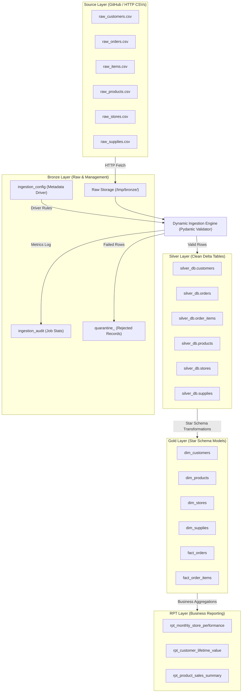
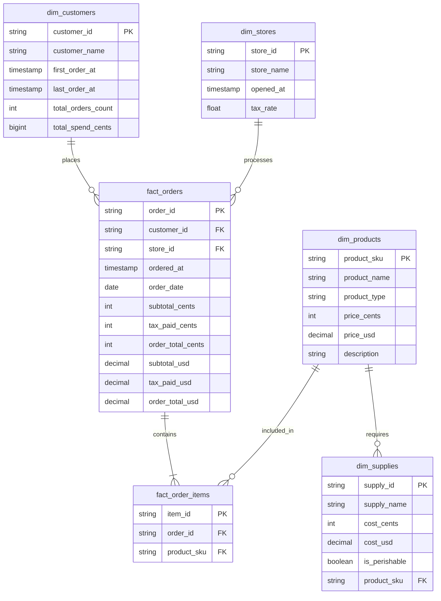

# Databricks Dynamic Data Ingestion & Medallion Architecture Project Documentation

> [!NOTE]
> This project implements a **metadata-driven, schemaless dynamic ingestion pipeline** built on Databricks (compatible with Databricks Community Edition). It dynamically ingests raw CSV files from GitHub, enforces strict data quality validations using **Pydantic**, isolates bad data in a **Quarantine framework**, logs job metrics into an **Audit table**, and transforms clean data through a **Medallion Architecture (Bronze $\rightarrow$ Silver $\rightarrow$ Gold $\rightarrow$ RPT)**.

---

## 1. Executive Summary & Architecture Overview

The goal of this project is to eliminate hardcoded, brittle ETL pipelines by introducing a **metadata-driven dynamic ingestion engine**. The pipeline reads driver rules from a single configuration table (`bronze_db.ingestion_config`) and dynamically transforms, validates, and routes data into clean Delta tables.

### Medallion Architecture Pipeline



---

## 2. Directory & File Structure

```
.
├── README.md
├── docs/
│   ├── Databricks_Dynamic_Ingestion_Documentaion.md
│   └── project_requirement.txt
├── ingestion/
│   ├── 00_setup_database_and_config.ipynb     # Initializes databases, config table & audit table
│   ├── ingestion.ipynb                        # Generic dynamic PySpark + Pydantic ingestion engine
│   └── ingestion_orchestration.ipynb          # Master orchestrator for dynamic multi-file ingestion
└── aggregation/
    ├── 01_gold_dimensions_and_facts.sql       # DDL/DML for Star Schema (Facts & Dimensions)
    ├── 02_rpt_reporting_tables.sql            # DDL/DML for Business Aggregations & Analytics
    └── gold_and_rpt_orchestration.ipynb       # Databricks execution wrapper for Gold & RPT
```

---

## 3. Metadata Driver Configuration (`bronze_db.ingestion_config`)

The `ingestion_config` table controls all data ingestion behavior. It decouples schema definitions and validation logic from code.

### Table Schema

| Column Name | Data Type | Description |
| :--- | :--- | :--- |
| `data_entry_seq_no` | `INT` | Unique sequence number for metadata entry |
| `source_location` | `STRING` | Public HTTP URL of the source raw file |
| `bronze_location` | `STRING` | DBFS/Local storage location for raw bronze file |
| `file_name_pattern` | `STRING` | File pattern identifier |
| `target_format` | `STRING` | Storage format (`delta`) |
| `target_table_name` | `STRING` | Target Delta table name in Silver layer |
| `target_table_db` | `STRING` | Target database name (`silver_db`) |
| `source_column_name`| `STRING` | Header column name in raw source CSV |
| `target_column_name`| `STRING` | Standardized column name in target table |
| `source_datatype` | `STRING` | Original data type in source file (`string`) |
| `target_datatype` | `STRING` | Desired target data type (`string`, `integer`, `float`, `boolean`, `timestamp`) |
| `target_data_pattern`| `STRING` | Data quality validation rule (`NOT_NULL`, `>=0`, `yyyy-MM-ddTHH:mm:ss`) |
| `col_seq_no` | `INT` | Column sequence order in target table |
| `data_entry_date` | `DATE` | Date when the rule entry was created |

### Configured Source Datasets & Mappings

1. **`raw_customers` $\rightarrow$ `silver_db.customers`**
   - `id` $\rightarrow$ `customer_id` (`string`, `NOT_NULL`)
   - `name` $\rightarrow$ `customer_name` (`string`, Nullable)

2. **`raw_orders` $\rightarrow$ `silver_db.orders`**
   - `id` $\rightarrow$ `order_id` (`string`, `NOT_NULL`)
   - `customer` $\rightarrow$ `customer_id` (`string`, `NOT_NULL`)
   - `ordered_at` $\rightarrow$ `ordered_at` (`timestamp`, ISO Format)
   - `store_id` $\rightarrow$ `store_id` (`string`, `NOT_NULL`)
   - `subtotal` $\rightarrow$ `subtotal_cents` (`integer`, `>=0`)
   - `tax_paid` $\rightarrow$ `tax_paid_cents` (`integer`, `>=0`)
   - `order_total` $\rightarrow$ `order_total_cents` (`integer`, `>=0`)

3. **`raw_items` $\rightarrow$ `silver_db.order_items`**
   - `id` $\rightarrow$ `item_id` (`string`, `NOT_NULL`)
   - `order_id` $\rightarrow$ `order_id` (`string`, `NOT_NULL`)
   - `sku` $\rightarrow$ `sku` (`string`, `NOT_NULL`)

4. **`raw_products` $\rightarrow$ `silver_db.products`**
   - `sku` $\rightarrow$ `sku` (`string`, `NOT_NULL`)
   - `name` $\rightarrow$ `product_name` (`string`, Nullable)
   - `type` $\rightarrow$ `product_type` (`string`, Nullable)
   - `price` $\rightarrow$ `price_cents` (`integer`, `>=0`)
   - `description` $\rightarrow$ `description` (`string`, Nullable)

5. **`raw_stores` $\rightarrow$ `silver_db.stores`**
   - `id` $\rightarrow$ `store_id` (`string`, `NOT_NULL`)
   - `name` $\rightarrow$ `store_name` (`string`, Nullable)
   - `opened_at` $\rightarrow$ `opened_at` (`timestamp`, ISO Format)
   - `tax_rate` $\rightarrow$ `tax_rate` (`float`, `>=0`)

6. **`raw_supplies` $\rightarrow$ `silver_db.supplies`**
   - `id` $\rightarrow$ `supply_id` (`string`, `NOT_NULL`)
   - `name` $\rightarrow$ `supply_name` (`string`, Nullable)
   - `cost` $\rightarrow$ `cost_cents` (`integer`, `>=0`)
   - `perishable` $\rightarrow$ `is_perishable` (`boolean`, Nullable)
   - `sku` $\rightarrow$ `product_sku` (`string`, Nullable)

---

## 4. Schemaless Dynamic Ingestion Engine & Pydantic Validation

The dynamic ingestion notebook (`ingestion/ingestion.ipynb`) executes without hardcoding table schemas or column names:

1. **Dynamic Model Generation**: Uses `pydantic.create_model(...)` to build a Pydantic validation class at runtime using rules loaded from `bronze_db.ingestion_config`.
2. **Type Casting & Rule Enforcement**: Converts string input into target primitive types (`int`, `float`, `bool`, `datetime`) and enforces constraint checks (e.g. non-nullability, non-negativity).
3. **Data Routing**:
   - **Valid Rows**: Enriched with `ingestion_timestamp` and saved as Delta tables in `silver_db`.
   - **Quarantined Rows**: Enriched with `quarantine_id`, `job_id`, `quarantine_timestamp`, raw JSON input, and error traceback, then saved into `bronze_db.quarantine_<target_table_name>`.
4. **Execution Audit**: Every pipeline execution logs job stats to `bronze_db.ingestion_audit`.

---

## 5. Audit & Quarantine Framework

### Audit Log Schema (`bronze_db.ingestion_audit`)

```sql
CREATE TABLE IF NOT EXISTS bronze_db.ingestion_audit (
    job_id STRING,
    target_table_db STRING,
    target_table_name STRING,
    source_location STRING,
    bronze_location STRING,
    start_time TIMESTAMP,
    end_time TIMESTAMP,
    total_records_processed LONG,
    success_count LONG,
    failed_count LONG,
    status STRING,
    error_summary STRING
) USING DELTA;
```

### Quarantine Table Schema (`bronze_db.quarantine_<dataset>`)

```sql
CREATE TABLE IF NOT EXISTS bronze_db.quarantine_orders (
    quarantine_id STRING,
    job_id STRING,
    quarantine_timestamp TIMESTAMP,
    raw_data_json STRING,
    error_message STRING
) USING DELTA;
```

> [!TIP]
> Quarantining bad records allows engineers to inspect data issues using SQL queries without blocking clean records from advancing into the Silver layer.

---

## 6. Gold Layer & RPT Layer Data Modeling

### Star Schema Entity Relationship (Gold Layer)



### Business Aggregation & Analytics Layer (`rpt_db`)

1. **`rpt_monthly_store_performance`**: Monthly revenue, order count, average order value, and total tax collected by store location.
2. **`rpt_customer_lifetime_value`**: Total lifetime spend, order frequency, first/last order dates, and customer classification (`VIP Customer` [$\ge\$100$], `Regular Customer` [$\ge\$30$], `Occasional Customer`).
3. **`rpt_product_sales_summary`**: Total units sold, gross revenue in USD, and rank by revenue.

---

## 7. Execution Guide for Databricks Community Edition

### Step 1: Import Repository
1. Log into your **Databricks Community Edition** workspace.
2. Navigate to **Workspace** $\rightarrow$ **Repos** (or Workspace root) $\rightarrow$ **Add Repo**.
3. Import this repository folder into your workspace.

### Step 2: Execution Order

1. **Run `ingestion/00_setup_database_and_config.ipynb`**
   - Creates `bronze_db`, `silver_db`, `gold_db`, `rpt_db`.
   - Populates `bronze_db.ingestion_config` metadata for all 6 tables.
2. **Run `ingestion/ingestion_orchestration.ipynb`**
   - Downloads source datasets to Bronze storage (`/tmp/bronze/`).
   - Runs `ingestion.ipynb` for each table (`customers`, `orders`, `order_items`, `products`, `stores`, `supplies`).
   - Populates Silver Delta tables, Quarantine tables, and logs Audit records.
3. **Run `aggregation/gold_and_rpt_orchestration.ipynb`**
   - Executes `01_gold_dimensions_and_facts.sql` to populate Gold Star Schema tables.
   - Executes `02_rpt_reporting_tables.sql` to populate RPT reporting tables.
   - Displays analytical query outputs.

---

## 8. Verification & Validation SQL Queries

You can execute the following SQL commands in a Databricks SQL notebook to verify pipeline success:

```sql
-- 1. Check Ingestion Audit Summary
SELECT target_table_name, status, total_records_processed, success_count, failed_count
FROM bronze_db.ingestion_audit
ORDER BY start_time DESC;

-- 2. Verify Silver Layer Record Counts
SELECT 'customers' AS table_name, COUNT(*) FROM silver_db.customers
UNION ALL SELECT 'orders', COUNT(*) FROM silver_db.orders
UNION ALL SELECT 'order_items', COUNT(*) FROM silver_db.order_items
UNION ALL SELECT 'products', COUNT(*) FROM silver_db.products
UNION ALL SELECT 'stores', COUNT(*) FROM silver_db.stores
UNION ALL SELECT 'supplies', COUNT(*) FROM silver_db.supplies;

-- 3. Query RPT Monthly Store Performance
SELECT * FROM rpt_db.rpt_monthly_store_performance ORDER BY year_month DESC, total_revenue_usd DESC;

-- 4. Query Customer Lifetime Value & Segments
SELECT customer_segment, COUNT(*) AS customer_count, SUM(total_lifetime_spend_usd) AS segment_revenue
FROM rpt_db.rpt_customer_lifetime_value
GROUP BY customer_segment;
```
